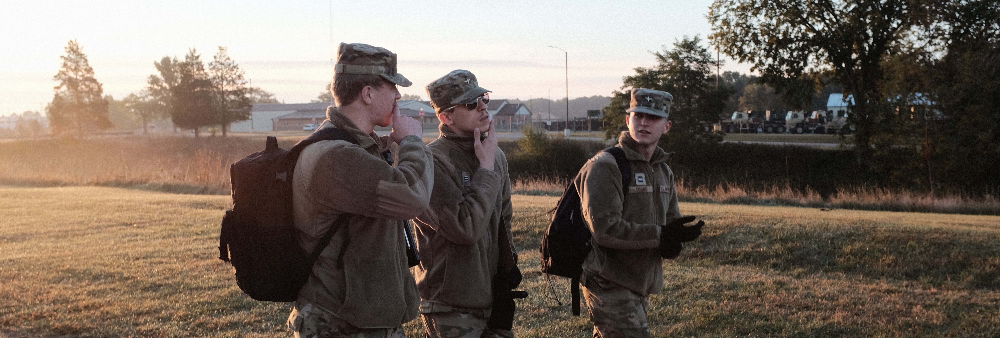

<!-- <BODY BGCOLOR="FFFFFF"> -->

 

<a href="https://www.linkedin.com/in/owenthomasyoung/" target="_blank" rel="noopener noreferrer">LinkedIn</a> | <a href="https://github.com/otyoung" target="_blank" rel="noopener noreferrer">GitHub</a> | <a href="http://www.otyoung.com/Documents/Owen%20Young%20Resume.pdf" target="_blank" rel="noopener noreferrer">Resume</a>

<section name="projects">
  <H2>Projects</H2>
  <H3>Metadating: EECS 449 (Conversational AI) Course Project<em>Fa 2022</em></H3>
  <H3>Ministry of Defence Covert TCP Channel Research Project<em>Su 2022</em></H3>
  <H3>Advanced Course in Engineering Cybersecurity Projects<em>Su 2022</em></H3>
  

    
    <H3>EECS 445 (Intro to Machine Learning) Course Projects<em>Wn 2022</em></H3>
    
Class projects for the University of Michigan's EECS 445. Project 1 worked with SVMs to explore linear classifiers, and Project 2 explored convolutional neural networks and the application of transfer learning.

  

   
  

    
    <H3>EECS 367 (Intro to Autonomous Robotics) Course Projects<em>Wn 2022</em></H3>
    
Class projects for the University of Michigan's EECS 367. Includes multiple path planning algorithms and forward and inverse kinematics.

  

  

  </section>
  
  
<H2>This is a Medium Header</H2>

Send me mail at <a href="mailto:support@yourcompany.com">

support@yourcompany.com</a>.

 This is a new paragraph!

 <B>This is a new paragraph!</B>

  <B><I>This is a new sentence without a paragraph break, in bold italics.</I></B>

